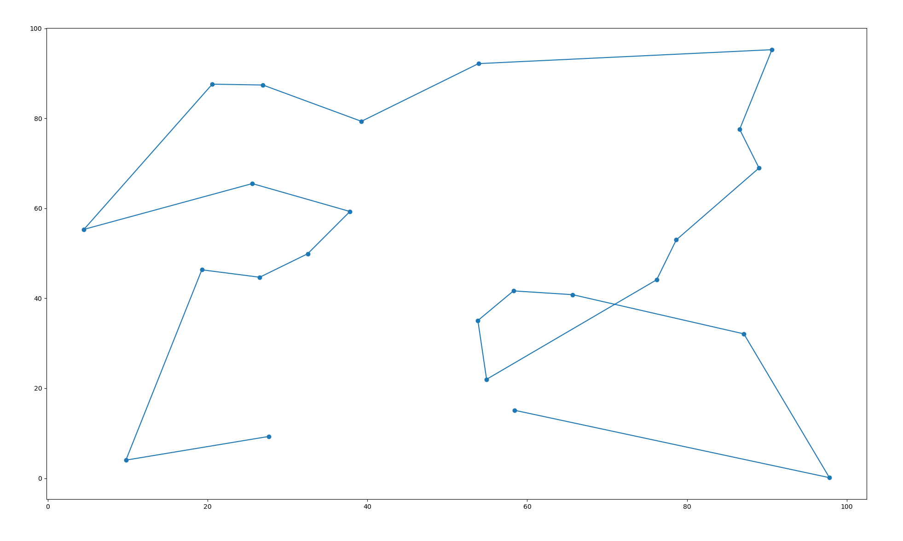
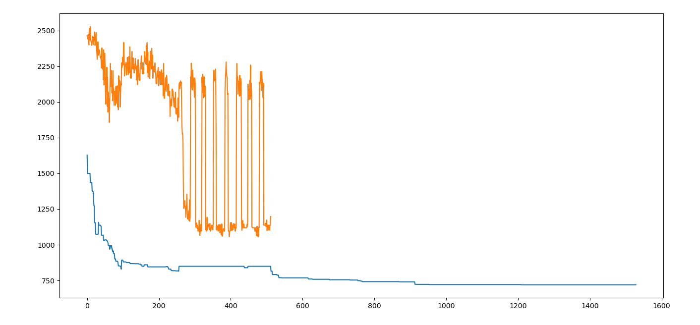

# Approximate Traveling Salesman Problem (TSP) solver with Probabilistic Evolutionary Computing /w Tribes

Approximate Traveling Salesman Problem (TSP) solver using probabilistic evolutionary computing with tribes

## Content

As a case study to use Probabilistic Evolutionary Computing for hyperparameter optimization for neural networks I played around a bit with TSP, since that is an easy NP-hard problem to quickly implement

### How it works:

A population is generated, consisting of float-vectors of the size of the number of cities. 

To generate a solution from  a vector we just get the order from big to small with an `argsort()` operation

Subsequently, the population is divided in a number of tribes. 

We distinguish epochs and sub-epochs

Tribes will evolve separately for a number of sub-epochs. 
Then, at the end of an epoch, all tribes come together, the weakest tribes are eliminated and the remaining tribes mix to form new tribes

If we further zoom into the sub-epoch level, we follow the following steps:
1. Apply random mutation to a small number of genomes for exploration
2. Kill the weakest percentage of the tribe
3. Generate a covariance matrix and mean vector of the remaining tribe-members and use those to sample new members with a multi-variate normal distribution

After the evolution step is done, we do a little of local optimization on the best sample we found

#### An example generated path



#### An example optimization path



- blue = best genome in the population
- orange = worst genome in the population

### Notes

I knew already beforehand that analytic solutions to TSP are better than evolutionary, this is also why I add local optimization in the end (which could be considered cheating).
However, as said before, this is just a proxy for using on neural network hyperparameter optimization. The main difference will be changing the fitness function evaluation and distribution to obtain new samples

Admittedly though, the number of times the fitness function is calles within this algorithm is too high for actual neural network hyperparameter optimization... 
Ah well, I had fun for one afternoon!

## Installation

```bash
sudo apt install python3-virtualenv
virtualenv venv
source venv/bin/activate
pip install -r requirements.txt
```

## CLI

Solver can be ran as a simple CLI. See documentation below

```
Usage: python cli.py [OPTIONS]

  Does a fair job at calculating the optimal route between N cities for the
  TSP Can be started with generated cities or if a file called cities.json is
  found in the same folder it will use that. Note: cities.json ought to be a
  simple 2D array of dimensions (n_cities, 2)

Options:
  --epochs INTEGER            Number of epochs in evolutionary algorithm
  --freq_interchange INTEGER  Number of sub-epochs which each tribe lives
                              isolated
  --kill_rate FLOAT           Fraction of genomes killed each sub-epoch
  --mutation_rate FLOAT       Fraction of genomes randomly mutated each epoch
  --n_cities INTEGER          Number of cities of optimization (will be
                              ignored if cities.json is in folder)
  --patience INTEGER          Steps of local optimization with no improvement
                              after which giving up (patience)
  --populations_size INTEGER  Number of genomes per tribe
  --tribes_n INTEGER          Number of tribes
  --help                      Show this message and exit.
```

> good defaults ar provided for these arguments